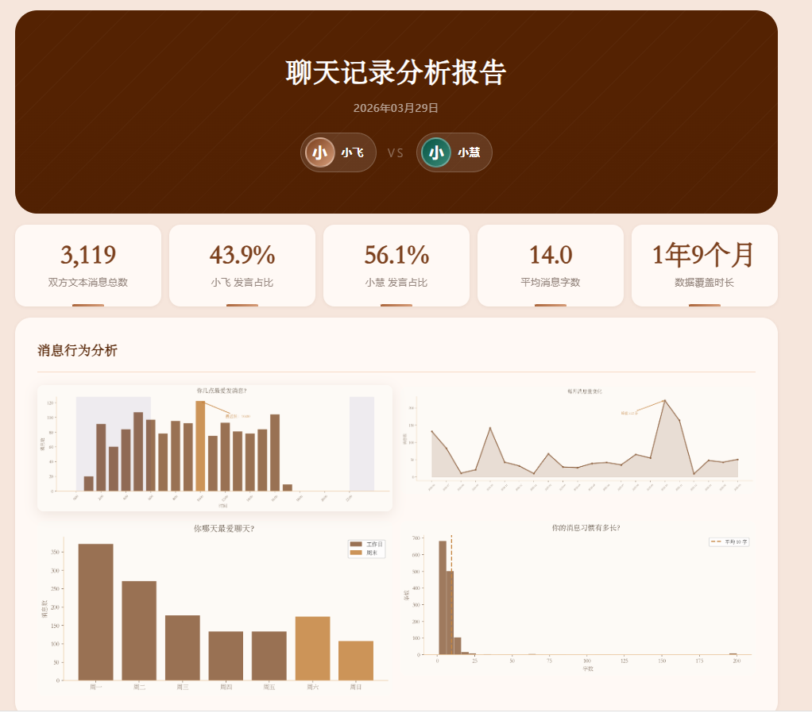
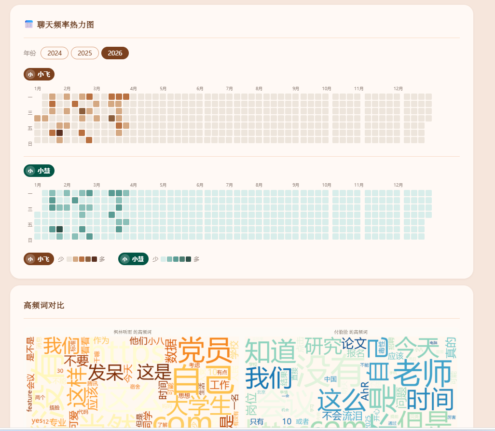
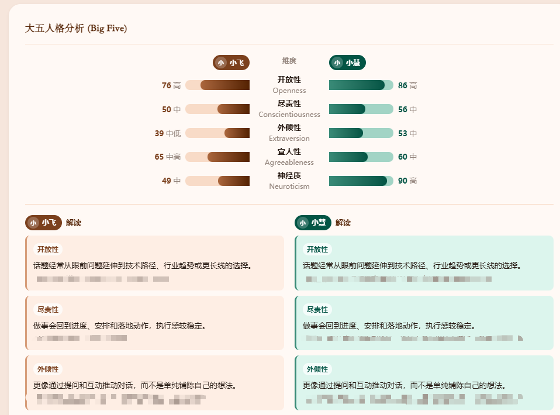
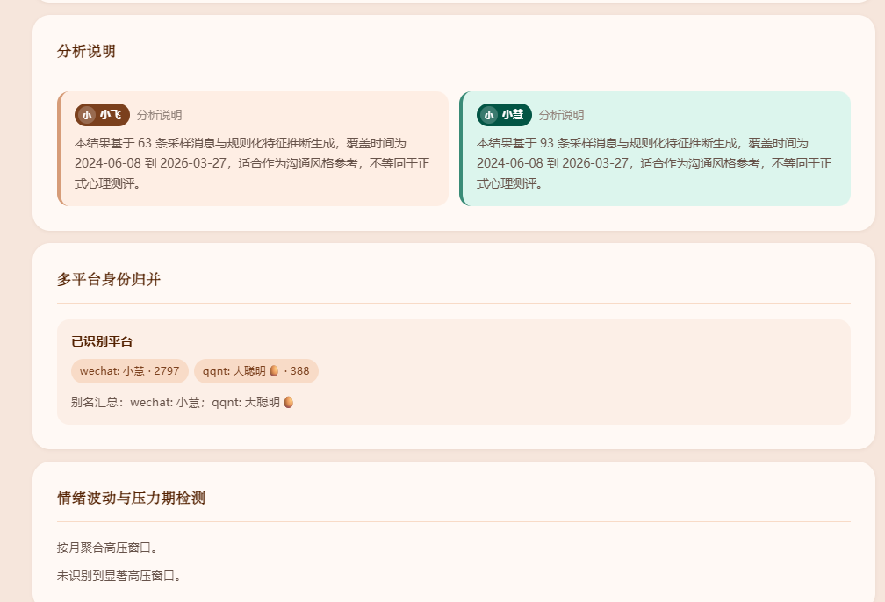
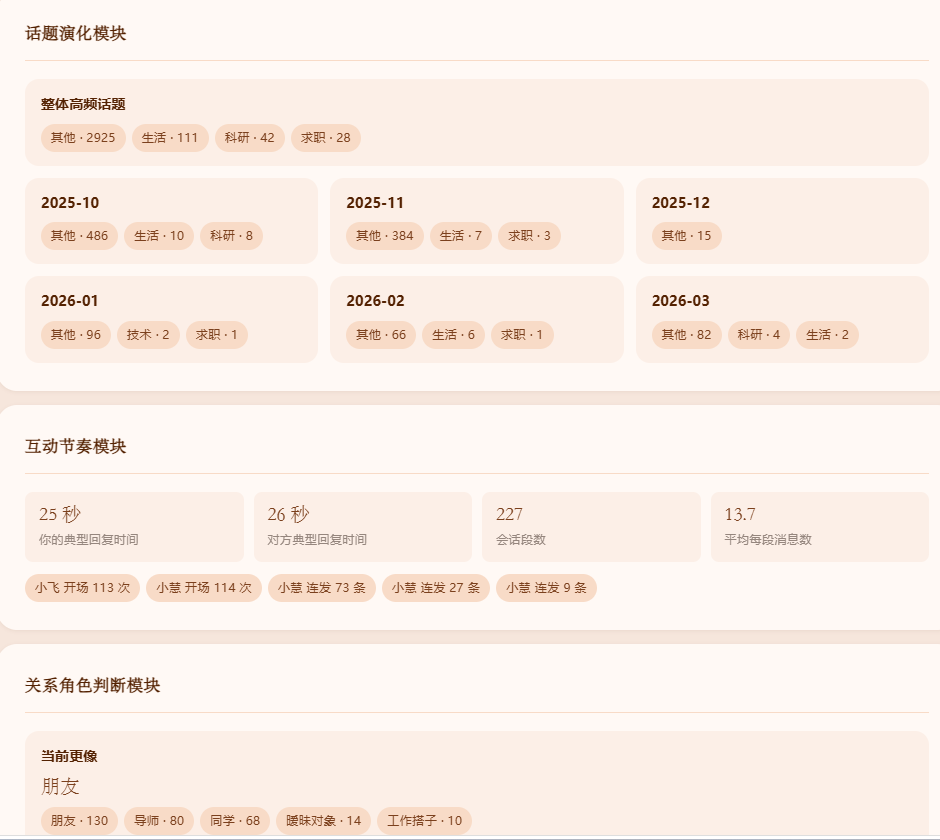
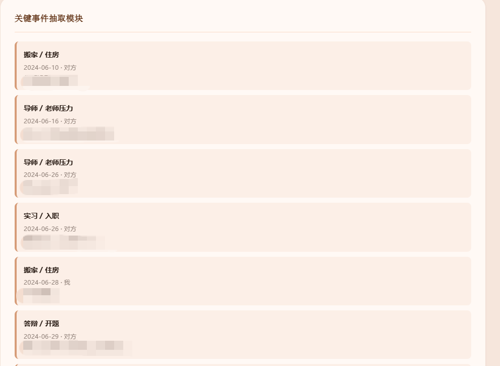
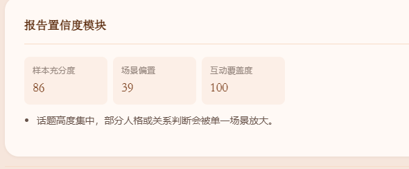

# 微信 / QQ 聊天记录分析工具

基于 [Jiang59991/ginger_wechat_portrait](https://github.com/Jiang59991/ginger_wechat_portrait) 改进的聊天记录分析项目。

原项目的核心定位是：
- 运行在 Claude Code 里的 Skill
- 面向 `macOS 12+` 与 `微信 Mac 4.x`
- 输入联系人名字后，自动生成双人聊天行为可视化 + AI 人格对比分析报告
- 不需要额外 Anthropic API Key，分析由 Claude Code 本地完成

当前仓库保留了原项目最有价值的部分：
- 双人聊天分析思路
- Big Five / MBTI / 风格总结报告结构
- 词云、活跃时段、月度趋势、星期分布、热力图等可视化报告形态
- 本地处理、可离线保存 HTML 报告的使用方式

同时，在这个基础上做了面向 Windows / Codex 场景的重构和扩展。

## 效果预览

| 报告总览 | 词云对比 + 大五人格 |
|---|---|
|  |  |

| 聊天频率热力图 | MBTI 双人推断 |
|---|---|
|  |  |

| AI 风格总结 | 高级分析模块 |
|---|---|
|  |  |



## 当前项目的亮点

### 1. 从 macOS Claude Skill 扩展为 Windows 可运行工具

原项目更偏向 `Claude Code + macOS 微信` 的 Skill 工作流。  
当前项目已经改成普通 Python 工具链，可以在 `Windows + Codex` 环境下直接运行，也保留了命令行形式，适合本地批量分析和二次开发。

### 2. 支持微信 + QQ 双平台导出与统一分析

当前项目不再只盯着单一来源的微信聊天，而是支持：
- Windows 微信 4 解密库导出
- Windows QQNT 私聊导出
- 多份 CSV 合并后统一分析
- 同一个人跨平台身份归并，例如“微信联系人 A + QQ 联系人 B 实际是同一人”

这意味着报告不只是“单平台聊天画像”，还可以做“同一个人在多个平台上的总画像”。

### 3. 不依赖外部 API Key，默认一次运行就出完整报告

当前版本默认流程是：
1. 读取 CSV
2. 自动做统计分析
3. 自动生成人格结果 JSON
4. 直接输出完整 HTML 报告

也就是说，默认不再需要你手工补人格结果 JSON，直接运行就能拿到完整报告。

### 4. 新增多种高级分析模块

在原项目基础上，当前版本新增了这些模块：
- 情绪波动与压力期检测
  按周或按月统计焦虑、担心、开心等表达，识别高压窗口
- 话题演化模块
  按“求职 / 科研 / 生活 / 技术”等主题观察不同时间段的话题重心
- 互动节奏模块
  统计典型回复时间、会话段数量、平均每段消息数、谁更容易开场、谁更容易连续输出
- 关系角色判断模块
  粗略判断更像“同学 / 朋友 / 导师 / 工作搭子 / 暧昧对象”等互动结构
- 关键事件抽取模块
  自动抽取 offer、面试、答辩、导师压力、实习入职、搬家等事件节点
- 多平台身份归并模块
  在合并报告中明确展示同一联系人在不同平台上的别名和消息来源
- 报告置信度模块
  对样本充分度、场景偏置、互动覆盖度做单独评分，而不只是给一段模糊说明

### 5. 项目结构已经重新整理

原项目的核心分析逻辑大多堆在仓库根目录。  
当前项目已经按职责拆分：

```text
chat_analyzer/
├── analysis/     # 数据清洗、统计、采样、人格与高级分析模块
├── reporting/    # 图表与 HTML 报告生成
└── utils/        # 控制台编码等通用工具

tools/            # 微信/QQ 导出、CSV 合并工具
exports/          # 导出得到的 CSV
outputs/          # 分析结果与 HTML 报告
main.py           # 主入口
```

这样后续继续加模块、改规则、换报告样式时，不需要再把代码都塞进一个文件里。

## 和原项目的关系

如果你看过原仓库，可以把当前项目理解为：

> 基于 `ginger_wechat_portrait` 的分析思路、报告形式和“本地完成分析”的理念，  
> 继续向 `Windows`、`QQNT`、`多平台合并`、`可维护目录结构` 和 `更丰富的高级分析模块` 方向做的工程化扩展版本。

当前仓库并不是对原项目的逐字复制，而是在原有方向上做了重新组织和增强。

## 当前支持

| 项目 | 当前版本 |
|---|---|
| 操作系统 | Windows 10 / 11 |
| Python | 3.10+ |
| 运行环境 | Codex、Claude Code、普通终端均可 |
| 微信 | Windows 微信 4.x 解密后的 `db_storage` |
| QQ | Windows QQNT 的 `nt_db` + SQLCipher key |
| API Key | 默认不需要 |

说明：
- 当前仓库的微信导出链路是 `Windows 微信 4` 方向，不是原项目的 `macOS 微信 4` Skill 路线。
- 如果你已经有导出的聊天 CSV，也可以跳过导出，直接分析。

## 可以生成什么

运行后会生成一份本地 HTML 报告，通常包含：
- 消息行为分析
  - 24 小时活跃分布
  - 月度消息趋势
  - 星期分布
  - 消息长度分布
  - 聊天频率热力图
- 语言内容分析
  - 单人或双人词云
- 人格分析
  - Big Five
  - MBTI 风格映射
  - AI 风格总结
- 高级分析
  - 情绪波动与压力期检测
  - 话题演化
  - 互动节奏
  - 关系角色判断
  - 关键事件抽取
  - 多平台身份归并
  - 报告置信度

所有内容整合为一份 HTML 报告，适合本地查看、截图或二次整理。

## 快速开始

### 1. 安装依赖

```powershell
python -m venv .venv
.\.venv\Scripts\python.exe -m pip install -r requirements.txt
```

### 2. 导出微信聊天

```powershell
.\.venv\Scripts\python.exe .\export_contact_windows_v4.py `
  --db-dir "<DECRYPTED_WECHAT_DB_DIR>" `
  --contact "联系人A" `
  --output ".\exports\wechat\contact_a.csv"
```

### 3. 导出 QQ 聊天

```powershell
.\.venv\Scripts\python.exe .\export_qq_nt_c2c.py `
  --db-dir "<QQ_NT_DB_DIR>" `
  --key "<QQ_NT_KEY>" `
  --contact "联系人B" `
  --output-dir ".\exports\qq\c2c"
```

### 4. 合并多个来源

```powershell
.\.venv\Scripts\python.exe .\merge_analysis_exports.py `
  ".\exports\wechat\contact_a.csv" `
  ".\exports\qq\c2c\qq_contact_b.csv" `
  --output ".\exports\merged\merged_chat.csv" `
  --partner-name "合并对象"
```

### 5. 运行分析

```powershell
.\.venv\Scripts\python.exe .\main.py `
  ".\exports\merged\merged_chat.csv" `
  --output ".\outputs\merged\merged_chat"
```

如果只分析单个平台的一份 CSV，也可以直接把那份 CSV 传给 `main.py`。

## 输出文件

分析结果会保存在你指定的输出目录，通常包括：

```text
outputs/
└── merged_chat/
    ├── report.html
    ├── report.css
    ├── personality_input.json
    ├── partner_input.json
    ├── personality_result_generated.json
    ├── partner_result_generated.json
    ├── advanced_insights.json
    ├── personality_raw.json
    └── charts/
        ├── hourly.png
        ├── monthly_trend.png
        ├── weekday_bar.png
        ├── length_dist.png
        ├── word_cloud.png / word_cloud_pair.png
        └── radar.png
```

## 隐私说明

- 所有分析都在本地完成
- 默认不需要额外 API Key
- 不会主动上传聊天内容到其他外部服务
- 请仅分析你自己设备上的数据，或在获得明确授权后使用

## 适合谁

这个项目适合：
- 想把微信 / QQ 聊天做成一份可读报告的人
- 想做双人关系画像、沟通风格分析、跨平台聊天归并的人
- 想在本地可控环境中处理聊天数据的人
- 想在原项目基础上继续开发新模块的人

## 致谢

本项目基于 [Jiang59991/ginger_wechat_portrait](https://github.com/Jiang59991/ginger_wechat_portrait) 的思路与基础实现改进而来。  
感谢原项目把“聊天记录可视化 + 本地人格分析报告”这条路线先跑通。

---

如果你想看更细的目录说明、命令示例和运行文档，请打开：

- [项目说明与运行文档.md](./项目说明与运行文档.md)
